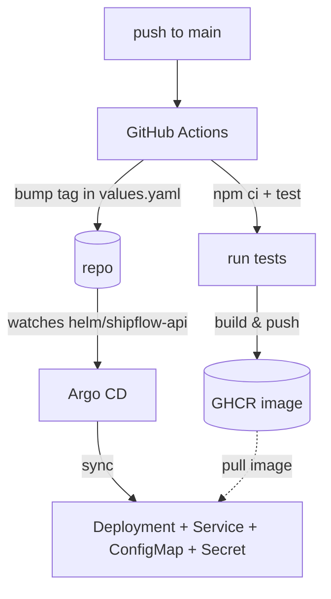

# ShipFlow GitOps

This is a small project I put together to get hands-on with a full GitOps setup — going from a code push all the way to a running pod in Kubernetes, with no manual deploy steps in between.

The idea: push to `main`, GitHub Actions builds and tests the app, pushes a Docker image, then updates the Helm chart with the new image tag and commits that back to the repo. Argo CD is watching the chart path and picks up the change automatically.

## Stack

- Node.js / Express (the actual API)
- Docker
- GitHub Actions (CI)
- Helm (packaging)
- Argo CD (deployment / sync)
- Kubernetes

## How it fits together



The part I like most is the CI job writing back to its own repo — it edits `helm/shipflow-api/values.yaml` with the new image SHA and pushes the commit itself, which is what actually triggers Argo CD. Everything after that is Argo CD's job, not GitHub Actions'.

## Project layout

```
app/                  the Express app
  src/
    controllers/      route handlers
    routes/           / , /health , /version
    middleware/       logging, 404, error handling
    config/           env loading
    utils/            winston logger
  Dockerfile

helm/shipflow-api/    the chart used for deployment
  templates/          deployment, service, configmap, secret
  values.yaml         image tag, resources, probes, env

argocd/
  application.yaml    Argo CD Application pointing at the chart

.github/workflows/
  ci.yml              build, test, push, bump chart
```

## Endpoints

Nothing fancy yet, just enough to prove the deployment works:

- `GET /` — app name, version, environment
- `GET /health` — used by the k8s liveness/readiness probes
- `GET /version` — current version from package.json

## Running it locally

```bash
cd app
npm install
npm run dev
```

Or in a container:

```bash
docker build -t shipflow-api ./app
docker run -p 3000:3000 shipflow-api
```

Env vars it reads: `APP_NAME`, `APP_ENV`, `PORT` (default 3000), `LOG_LEVEL`.

## Deploying manually

Normally Argo CD does this on its own, but if you want to try it by hand:

```bash
helm upgrade --install shipflow-api ./helm/shipflow-api \
  --namespace shipflow --create-namespace
```

## Known issues / things to fix

- `values.yaml` has a placeholder `JWT_SECRET` sitting in plaintext right now — that's obviously not okay for anything beyond messing around locally. Need to swap it for Sealed Secrets or External Secrets before this goes anywhere near a real cluster.
- No real test suite yet, `npm test` is just a stub.
- No ingress, so right now it's ClusterIP only — fine for internal testing, not reachable from outside the cluster.
- Single replica, no autoscaling configured.

## Why I built this

Wanted a project that actually exercises the whole pipeline instead of just talking about GitOps in theory — CI building images, a chart that gets updated by automation rather than by hand, and a CD tool doing the actual rollout. Still adding to it as I go.